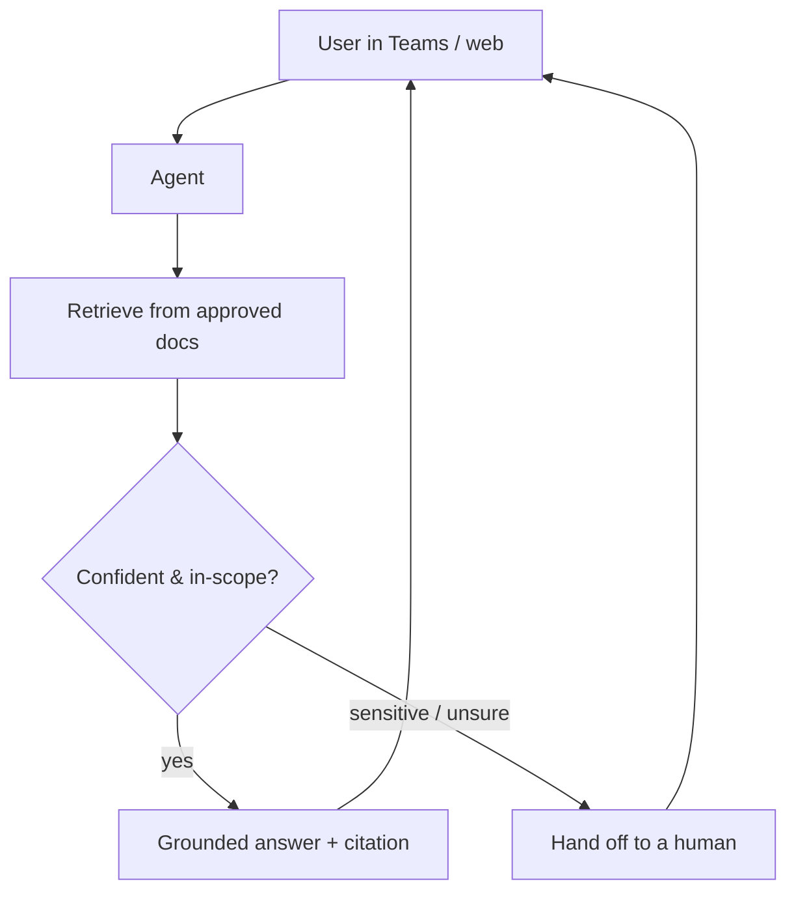

# Copilot Studio support agent

A Microsoft 365 AI agent that answers staff and customer questions from your
SharePoint documents, **cites its sources**, and **hands off to a human** when
it's unsure or the topic is sensitive.

Ships with an offline simulator, a multi-turn conversation wrapper, an
evaluation harness with a golden Q&A set, and a declarative Copilot Studio
template — so you can see the exact behaviour, prove it doesn't regress, and
recreate it in a real tenant.

```bash
python sim/run.py            # single-turn demo: grounded answers + escalation
python sim/cli.py            # interactive multi-turn REPL
python evals/run.py          # run the golden eval set; exit 0 = all pass
python -m pytest sim/tests/ -q
```

Stdlib-only Python, no keys, no tenant required to run any of this.

## The problem it solves

Teams lose hours every week answering the same routine HR/IT questions, and most
are (rightly) nervous about an AI giving wrong or unsafe answers on sensitive
matters — refunds, HR disputes, security. The agent here is built around three
guarantees: answers are **grounded only in approved documents**, every answer
**carries a citation**, and sensitive or low-confidence questions **escalate to
a person** instead of being guessed.



## Architecture in one paragraph

`Agent.ask()` runs three steps in order: (1) sensitivity check on the bare
current question → escalate if matched; (2) TF-IDF retrieval over the document
corpus; (3) confidence gate → escalate if the top score is below threshold,
otherwise generate a grounded answer with `[n]` citations. `Conversation` is a
thin wrapper that re-runs the turn with prior-question context **only when the
bare query is uncertain**, so strong-signal questions aren't polluted by
unrelated earlier topics. Full diagrams + per-component notes in
[docs/architecture.md](docs/architecture.md).

## Sample output

```text
USER: How do I reset my password?
AGENT: ...portal.example.com [1] ...
       sources: [1] it-support.md, [2] hr-policy.md

USER: I want a refund on my subscription
AGENT (escalated, sensitive topic): I'm connecting you with a specialist who can help with this.

USER: What is the airspeed velocity of an unladen swallow?
AGENT (escalated, low confidence): I don't have a confident answer — let me hand you to a team member.
```

Full captured run (single-turn + multi-turn follow-ups inheriting context):
[docs/sample-run.txt](docs/sample-run.txt).

## Evaluation

A golden Q&A set under [evals/golden.json](evals/golden.json) covers grounded
answers across HR / IT / Security docs plus sensitive-topic and low-confidence
escalations.

```bash
$ python evals/run.py
Eval: 16/16 passed (100%)
```

How to add cases (real-world failure capture, adversarial prompts, paraphrases) is
in [docs/evaluation.md](docs/evaluation.md).

## Customization

Five typical tuning points — corpus, sensitive-topic list, confidence threshold,
plugging a real LLM, adding new intents — are walked through in
[docs/customization.md](docs/customization.md). Most are one-line edits in
[sim/agent.py](sim/agent.py), mirrored in
[agent-template/agent.yaml](agent-template/agent.yaml).

## What's inside

| Path | Purpose |
|------|---------|
| [sim/agent.py](sim/agent.py) | Agent + Retriever. Stateless `ask()`; ~120 LOC. |
| [sim/conversation.py](sim/conversation.py) | Multi-turn wrapper with smart context injection. |
| [sim/cli.py](sim/cli.py) | Interactive REPL. `reset` clears context, `quit` exits. |
| [sim/run.py](sim/run.py) | Scripted demo: 5 questions covering both escalation paths. |
| [sim/data/](sim/data/) | Sample HR / IT / Security docs the agent answers from. |
| [sim/tests/](sim/tests/) | 9 pytest tests covering agent + conversation behaviour. |
| [evals/](evals/) | Golden Q&A set + runner; CI-gating exit code. |
| [agent-template/](agent-template/) | Declarative agent design (YAML + topics + prompts) for Copilot Studio. |
| [deploy-guide.md](deploy-guide.md) | Step-by-step tenant build + go-live checklist. |
| [docs/](docs/) | Architecture, customization, and evaluation guides. |

## Taking it to a real tenant

Build the agent in Copilot Studio following [deploy-guide.md](deploy-guide.md),
point it at the client's SharePoint, tune the topics and escalation rules to
their business, and publish to Teams or the web. The eval set doubles as the
acceptance test — copy it as-is and replace the sample questions with real ones
from the client.
