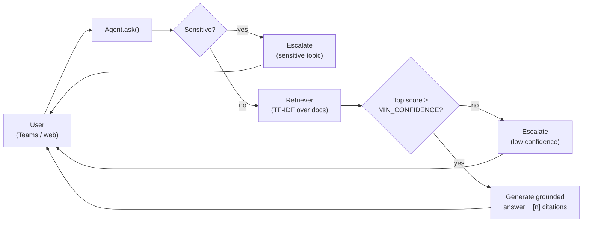
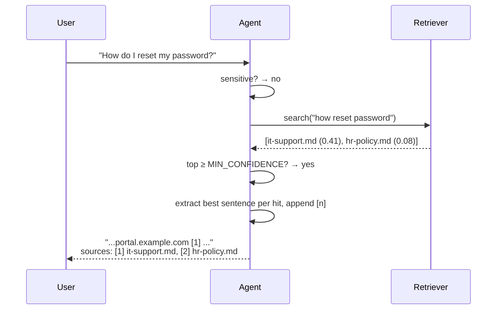
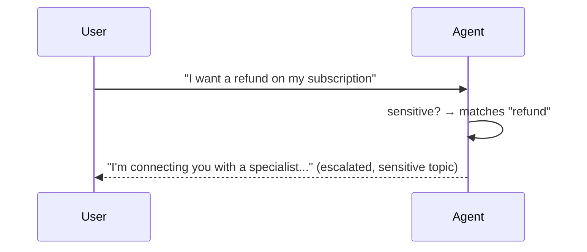

# Architecture

A small system with strict guarantees: ground every answer in approved documents,
cite the source, and **escalate** rather than guess on sensitive or low-confidence
questions. The simulator in `sim/` is the executable specification; Copilot Studio
in production recreates the same behaviour declaratively.

## Components

| Piece | Lives in | Job |
|-------|----------|-----|
| `Agent` | [sim/agent.py](../sim/agent.py) | Orchestrates the turn: sensitivity check → retrieval → confidence gate → grounded answer. |
| `Retriever` | [sim/agent.py](../sim/agent.py) | TF-IDF over the document corpus. Stdlib only; one `search(query, k)` method. |
| Sensitivity policy | `SENSITIVE` tuple in [sim/agent.py](../sim/agent.py) | Topics the agent must never answer — refunds, legal, salary, breach. |
| Confidence gate | `MIN_CONFIDENCE` in [sim/agent.py](../sim/agent.py) | Below this retrieval score, escalate instead of guess. |
| `Conversation` | [sim/conversation.py](../sim/conversation.py) | Multi-turn wrapper. Carries prior questions into retrieval **only when** the bare query is uncertain. |
| Declarative template | [agent-template/](../agent-template/) | The same configuration as YAML / JSON / prompts, for Copilot Studio. |
| Eval harness | [evals/](../evals/) | Golden Q&A dataset + runner that gates regressions. |

## Turn sequence — grounded answer

## Turn sequence — sensitive escalation

## Why the design looks like this

- **Escalation policy runs first, on the bare current question.** Multi-turn context
  must not be able to mask or trigger an escalation that the user didn't intend in
  *this* turn.
- **Citations are positional `[n]` markers**, not URLs. The simulator returns the
  document object; the UI layer (or Copilot Studio) renders the citation however it
  wants — link, hover card, side panel.
- **TF-IDF, stdlib only.** The whole point of this repo is to be runnable in 30
  seconds without keys. A real deployment swaps the `complete()` step for a
  managed LLM (see [customization.md](customization.md)); retrieval can stay TF-IDF
  for many internal-knowledge use cases or upgrade to embeddings without changing
  the rest of the flow.
- **Conversation is opt-in.** `Agent.ask()` stays stateless; multi-turn is a thin
  wrapper. This keeps testing easy and lets you reason about a single turn in
  isolation.

## Where to look first if something goes wrong

| Symptom | Look here |
|---------|-----------|
| Agent answers a sensitive question instead of escalating | `SENSITIVE` tuple in [sim/agent.py](../sim/agent.py) — add the missing term. |
| Agent escalates everything as low confidence | `MIN_CONFIDENCE` in [sim/agent.py](../sim/agent.py) — too high for your corpus. |
| Wrong document gets cited | Add the question to [evals/golden.json](../evals/golden.json) and tune from there. |
| Follow-up loses topic | Increase `window` in `Conversation(agent, window=…)` or add a topic-shift heuristic. |
