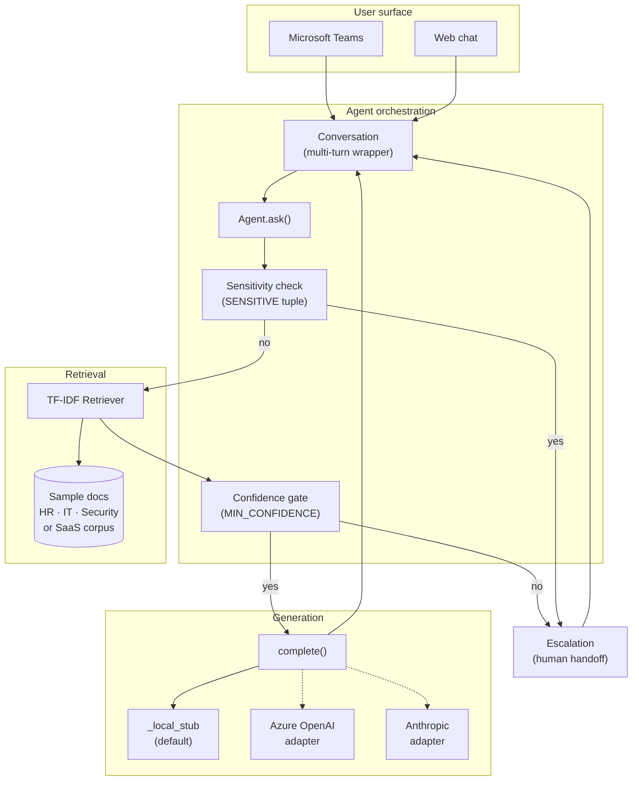
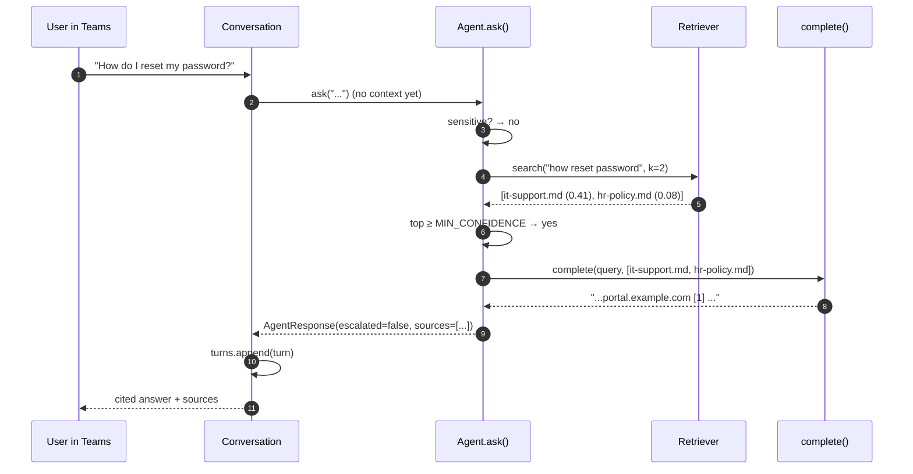
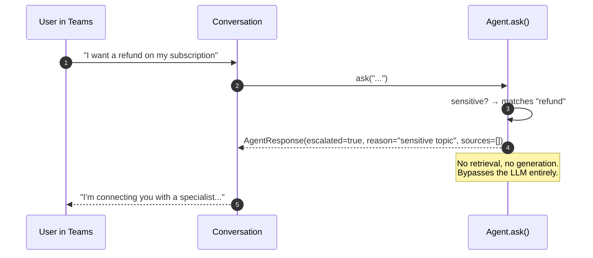
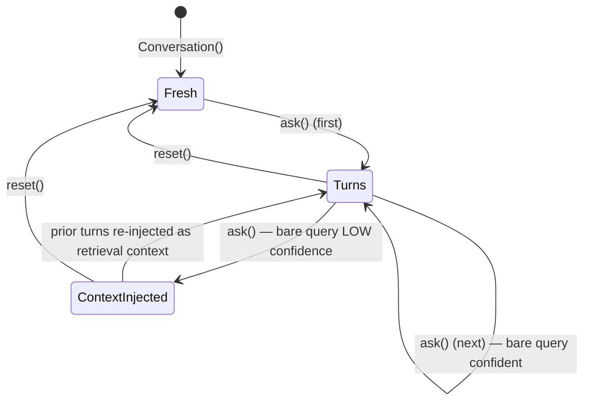
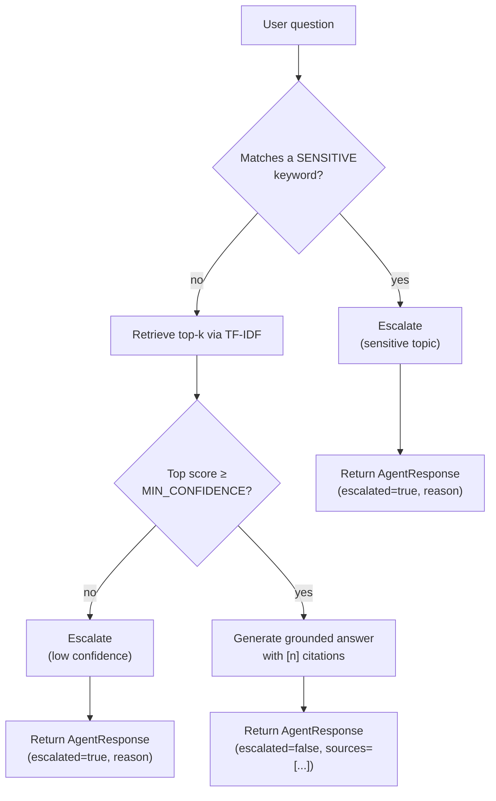

# Diagrams

These are the diagrams you'd put in front of a client or in an architecture
review — broader than the in-line ones in [architecture.md](architecture.md).

## 1. Component model (boxes + responsibilities)

## 2. Sequence — grounded answer with citations

## 3. Sequence — sensitive-topic escalation

## 4. State — multi-turn conversation context lifecycle

The `ContextInjected` transition is the one that makes follow-ups like
"what about for managers?" work — `Conversation.ask()` first tries the
bare query, and only retries with prior-turn context if the first attempt
returned `escalated=true, reason="low confidence"`.

## 5. Decision tree — single turn

